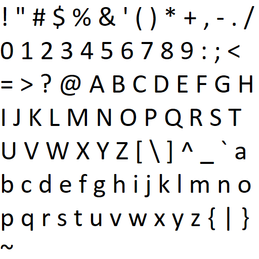

# someFontTextureGen

Simple font texture generator adapted from a Direct2D sample in the Windows 7 SDK (SaveAsImageFileSample).

Although the code is platform-specific (Windows), the output texture image could be used for rendering text on any graphics API or platform (via basic texture mapping).

### Windows Build Instructions

1. Install Windows 7 SDK
2. Open project file with VS2013 (or newer)

Note: there aren't any plans to support other platforms.

### Sample Output

512x512 font texture, visible ASCII characters in Calibri (size 54):

### TODO
* Change code to take command-line parameters to set font, font size, output texture size, etc.
  * Currently is hard-coded to write a 512x512 image containing all visible ASCII characters in a specific size in Calibri font.
* Also need to create metafile that maps characters to UV coordinates.
  * Currently, this mapping would need to be done manually - not very practical for different fonts, sizes, etc.
